# 2420-Assignment-3_2
## Task 1 Create two new digital ocean droplets
1. Created two droplets on digital ocean:
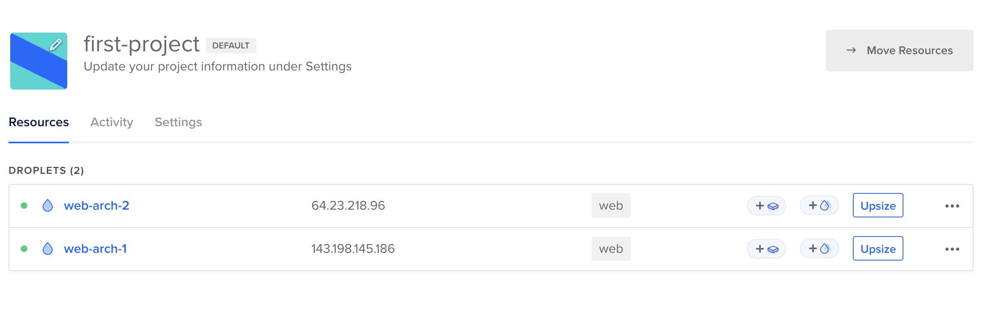
2. ssh into each droplets
- web-server-1:
```
ssh -i .ssh/2420assign1 arch@143.198.145.186
```
- web-server-2:
```
ssh -i .ssh/2420assign1 arch@64.23.218.96 
```
## Task 2 Creat load balancer
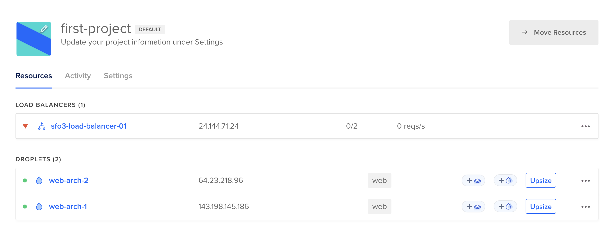
  - The status show down because I have not start nginx yet.

## Task 3 Clone the updated starter code (the following command also ran in web-arch-1)
1. Re-create the webgen user for each server using instruction from part 1.
```
sudo useradd --system -d /var/lib/webgen -s /usr/bin/nologin webgen
```
```
sudo chown -R webgen:webgen /var/lib/webgen
```
```
sudo mkdir -p /var/lib/webgen/bin
```
```
sudo mkdir -p /var/lib/webgen/HTML
```
Adding new directory documents
```
sudo mkdir -p /var/lib/webgen/documents
```
2. Clone updated generate_index file
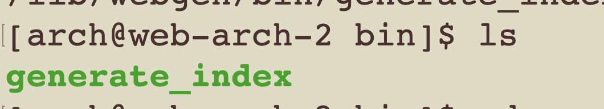
3. Create file-one and file-two under documents directory. 
```
sudo vim file-one
```
```
sudo vim file-two
```
I put simple content inside these two files.
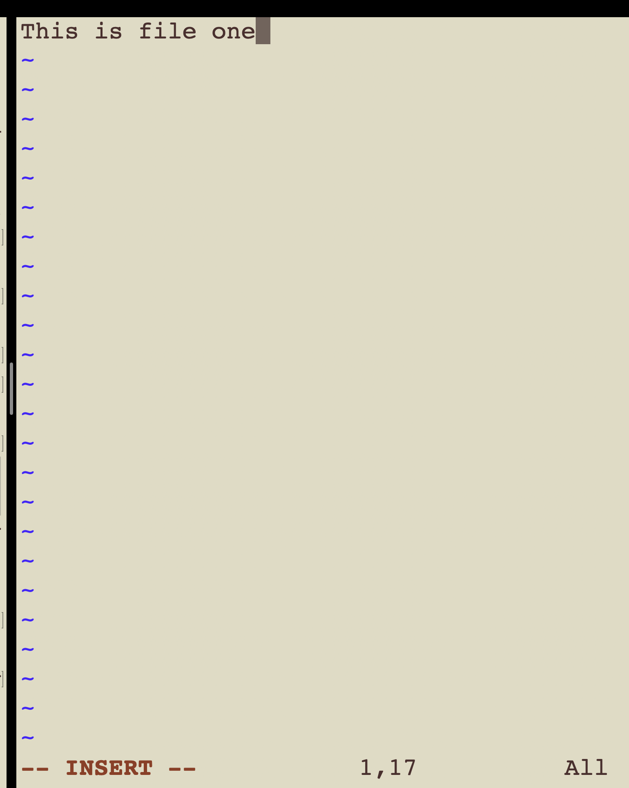

4. Set correct ownership
```
sudo chown webgen:webgen /var/lib/webgen/documents/file-one
```
5. Run the generate_index script to create index.html
```
sudo ./generate_index 
```
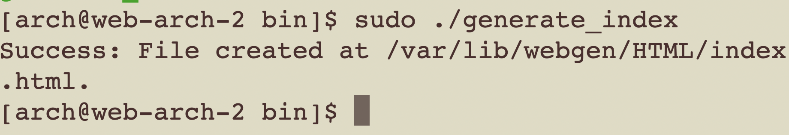
6. Verify
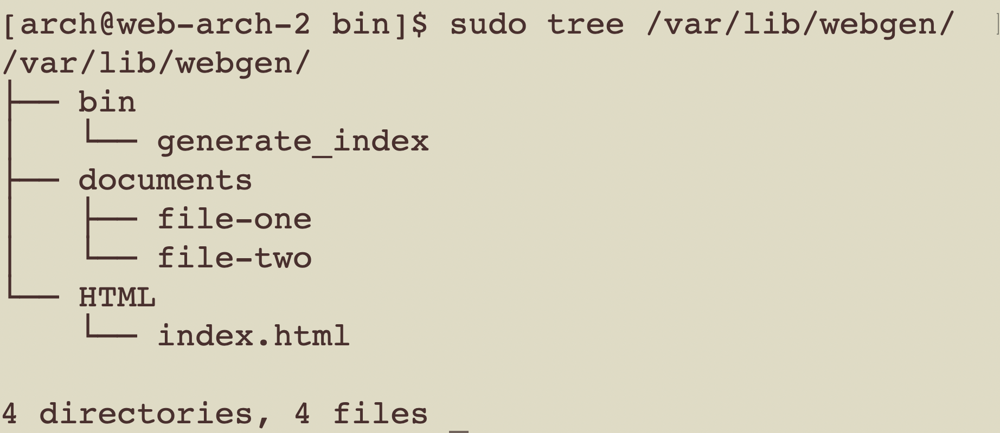
7. Create the generate-index.service for both server. (I used the same script for part 1) 
  - cd into `/etc/systemd/system/`
  - Config service file
  ```
  sudo vim generate-index.service
  ```
  ```
[Unit]
Description=Generate updated index 
Wants=network-online.target
After=network-online.target

[Service]
Type=oneshot
User=webgen
Group=webgen
ExecStart=/var/lib/webgen/bin/generate_index
WorkingDirectory=/var/lib/webgen
RemainAfterExit=yes

[Install]
WantedBy=multi-user.target
```

```
sudo systemctl enable generate-index.service
```
```
sudo systemctl start generate-index.service
```
```
sudo systemctl status generate-index.service
```
Change ownership and permission
```
sudo chown -R webgen:webgen /var/lib/webgen
```
```
sudo chmod -R 755 /var/lib/webgen
```
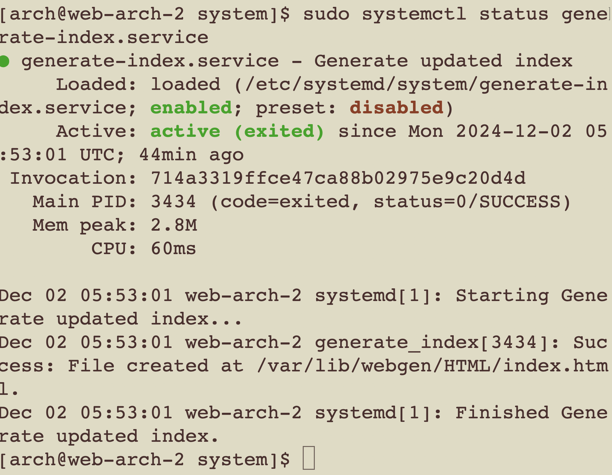
8. Create generate-index.timer
```
[Unit]
Description=Run Generate Index Script Daily

[Timer]
OnCalendar=*-*-* 05:00:00
Persistent=True

[Install]
WantedBy=timers.target
```
  
```
sudo systemctl enable generate-index.timer
```
```
sudo systemctl start generate-index.timer
```
```
sudo systemctl status generate-index.timer
```
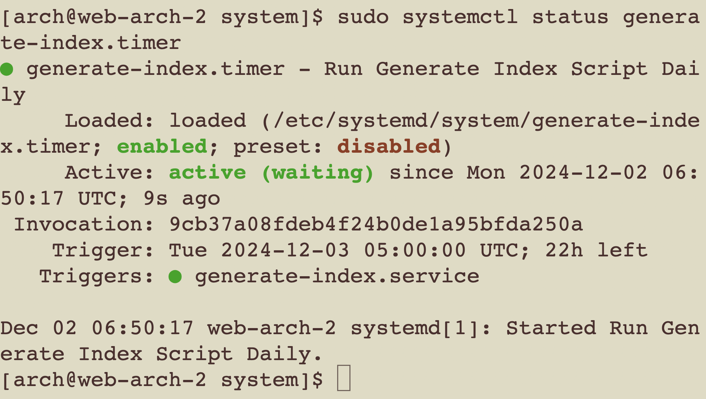

9. Nginx
- Modify nginx.conf to run as webgen
```
sudo vim /etc/nginx/nginx.conf
```
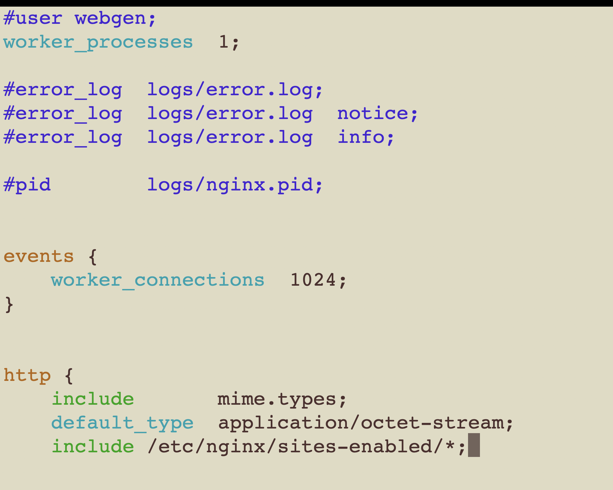
10. Create a Separate Server Block File
- Create directory
```
sudo mkdir -p /etc/nginx/sites-available 
sudo mkdir -p /etc/nginx/sites-enabled
```
- Create a new server block file:
```
sudo vim /etc/nginx/sites-available/webgen
```
```
server {
    listen 80;
    listen [::]:80;
    server_name 64.23.218.96;

    # Root directory for the file server
    location /documents {
        root /var/lib/webgen;
        autoindex on;                # Enables directory listing
        autoindex_exact_size off;    # Shows file sizes in human-readable format
        autoindex_localtime on;      # Displays file timestamps
    }

    # Default location for other requests (optional)
    location / {
        root /var/lib/webgen/HTML;
        index index.html;
    }
}
```
- Check syntax error
```
sudo nginx -t
```
- Create a symlink to enable the site:
```
sudo ln -s /etc/nginx/sites-available/webgen /etc/nginx/sites-enabled/
```
```
sudo systemctl enable nginx.service
```
```
sudo systemctl start nginx.service  
```
```
sudo systemctl status nginx.service 
```
11. Visit browser for using ip address for load balancer: http://24.144.71.24/

Server 2:

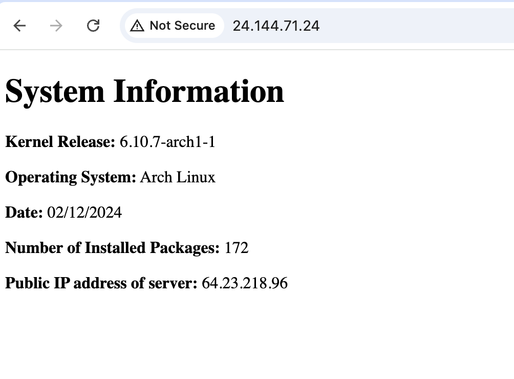

Server 1: 

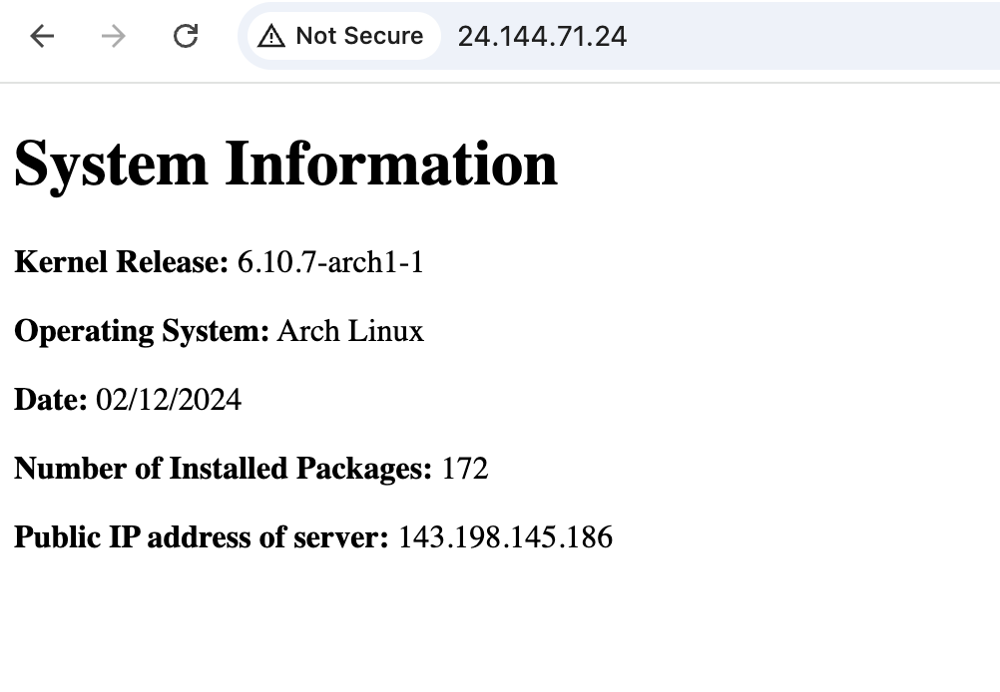

http://64.23.218.96/documents/

12. Visit documents page

http://24.144.71.24/documents/

In order to differentiate two server, I set up unique title for each.

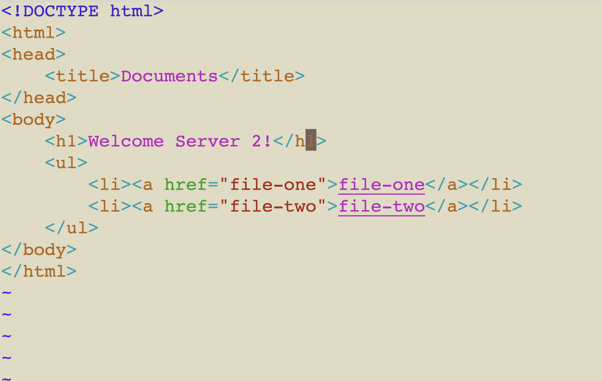
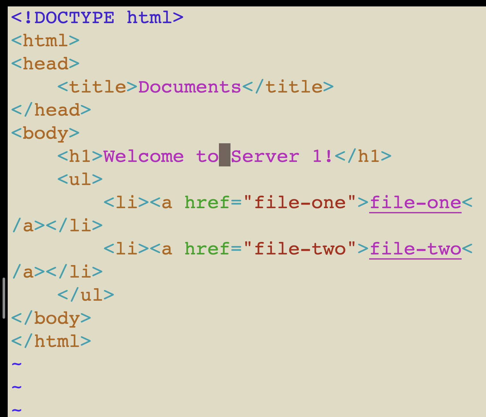

The document page looks like this in the browser:
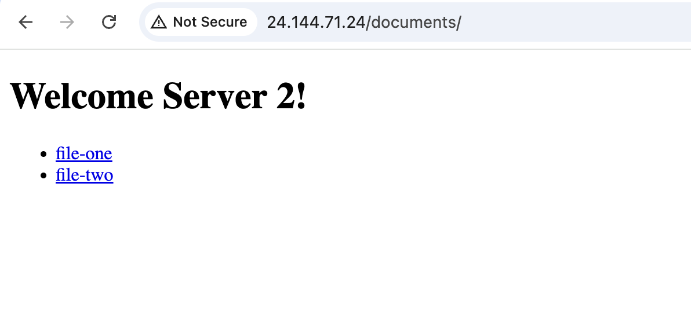
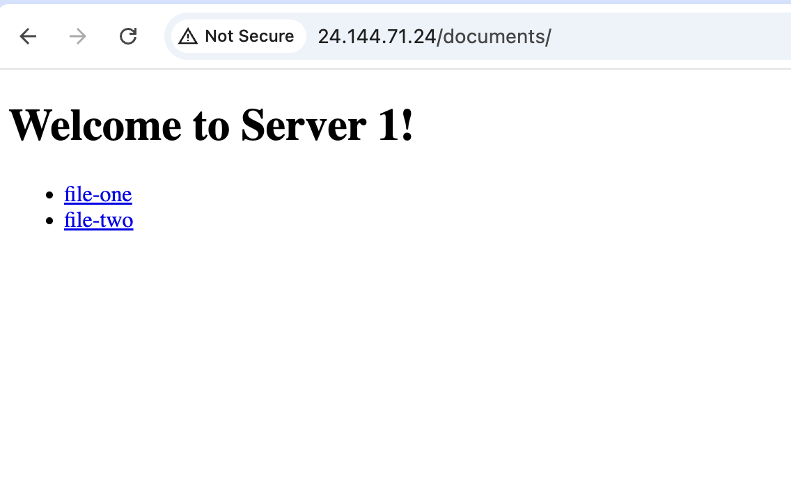


