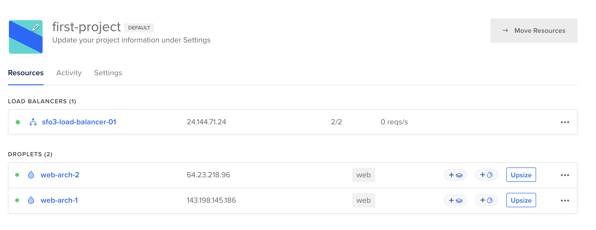
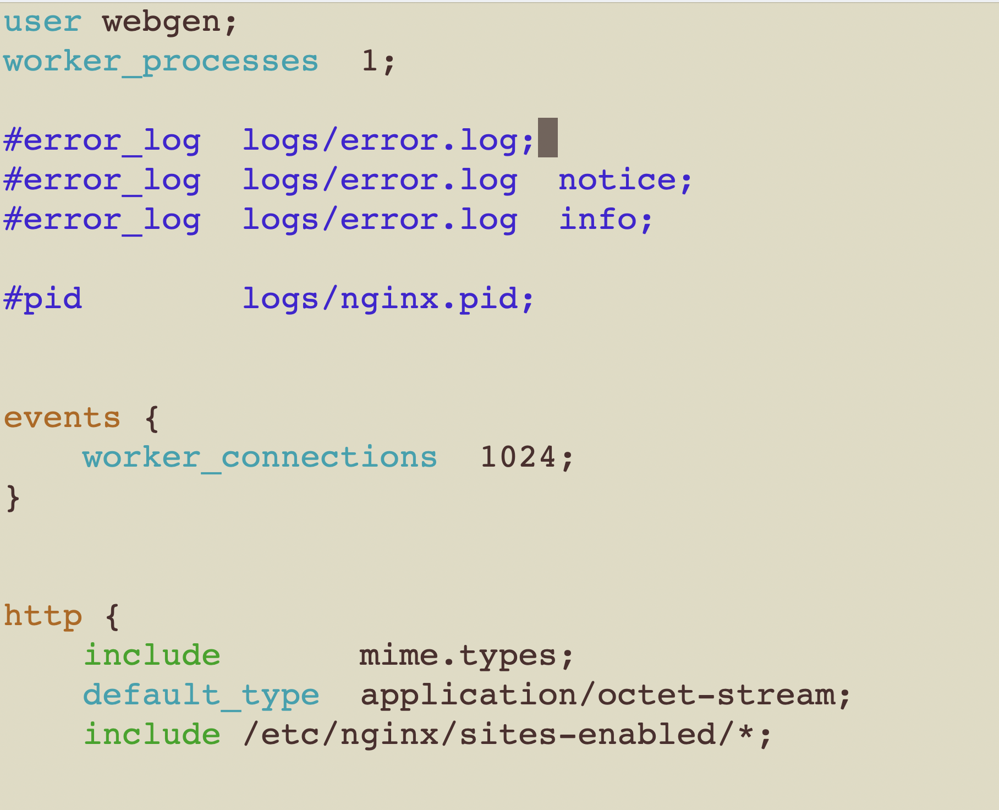

# 2420-Assignment-3_2
## Task 1 Create Two New Digital Ocean Droplets

1. Create two droplets on digital ocean with the `web` tag:


2. SSH into each droplets
- web-server-1:
```
ssh -i .ssh/2420assign1 arch@143.198.145.186
```
- web-server-2:
```
ssh -i .ssh/2420assign1 arch@64.23.218.96 
```
## Task 2 Create Load Balancer

  
## Task 3 Clone the Updated Starter Code 

1. Re-create the webgen user for both server using instruction from part 1
```
sudo useradd --system -d /var/lib/webgen -s /usr/bin/nologin webgen
```
```
sudo chown -R webgen:webgen /var/lib/webgen
```
2. Create required directory according to the instruction

```
sudo mkdir -p /var/lib/webgen/bin
```
```
sudo mkdir -p /var/lib/webgen/HTML
```

3. Add new directory `documents`
```
sudo mkdir -p /var/lib/webgen/documents
```

4. Clone updated `generate_index` file


5. Create  `file-one` and `file-two` under `documents` directory. 
```
sudo vim file-one
```
```
sudo vim file-two
```
- Put simple content inside these two files.


6. Set correct ownership
```
sudo chown webgen:webgen /var/lib/webgen/documents/file-one
```
7. Run the `generate_index` script to create `index.html`
```
sudo ./generate_index 
```

8. Verify directory structure

## Task 4 Configure Service File
1. Create the `generate-index.service` for both server. (I used the same script from part 1) 
  - cd into `/etc/systemd/system/`
  - Configure service file
  ```
  sudo vim generate-index.service
  ```
  ```
[Unit]
Description=Generate updated index 
Wants=network-online.target
After=network-online.target

[Service]
Type=oneshot
User=webgen
Group=webgen
ExecStart=/var/lib/webgen/bin/generate_index
WorkingDirectory=/var/lib/webgen
RemainAfterExit=yes

[Install]
WantedBy=multi-user.target
```
- Enable and start the service
```
sudo systemctl enable generate-index.service
```
```
sudo systemctl start generate-index.service
```
```
sudo systemctl status generate-index.service
```

2. Create `generate-index.timer` to automate `generate_index` daily:
```
[Unit]
Description=Run Generate Index Script Daily

[Timer]
OnCalendar=*-*-* 05:00:00
Persistent=True

[Install]
WantedBy=timers.target
```
- Enable and start the timer: 
```
sudo systemctl enable generate-index.timer
```
```
sudo systemctl start generate-index.timer
```
```
sudo systemctl status generate-index.timer
```


## Task 5 Configure Nginx

1. Modify `nginx.conf` to run as webgen
```
sudo vim /etc/nginx/nginx.conf
```


2. Create a separate server block file

- Create directory
```
sudo mkdir -p /etc/nginx/sites-available 
sudo mkdir -p /etc/nginx/sites-enabled
```
- Create a new server block file:
```
sudo vim /etc/nginx/sites-available/webgen
```
```
server {
    listen 80;
    listen [::]:80;
    server_name 64.23.218.96;

    # Root directory for the file server
    location /documents {
        root /var/lib/webgen;
        autoindex on;                # Enables directory listing
        autoindex_exact_size off;    # Shows file sizes in human-readable format
        autoindex_localtime on;      # Displays file timestamps
    }

    # Default location for other requests (optional)
    location / {
        root /var/lib/webgen/HTML;
        index index.html;
    }
}
```
Ref: https://docs.nginx.com/nginx/admin-guide/web-server/serving-static-content/
- Check syntax error
```
sudo nginx -t
```
- Create a symlink to enable the site:
```
sudo ln -s /etc/nginx/sites-available/webgen /etc/nginx/sites-enabled/
```
- Enable and start `nginx`:
```
sudo systemctl enable nginx.service
```
```
sudo systemctl start nginx.service  
```
```
sudo systemctl status nginx.service 
```
## Testing 

1. Visit browser using ip address for load balancer: http://24.144.71.24/

- Server 2:


- Server 1: 


2. Visit documents page:  http://24.144.71.24/documents/

- In order to differentiate two server, I set up unique title for each.


The document page looks like this in the browser:


